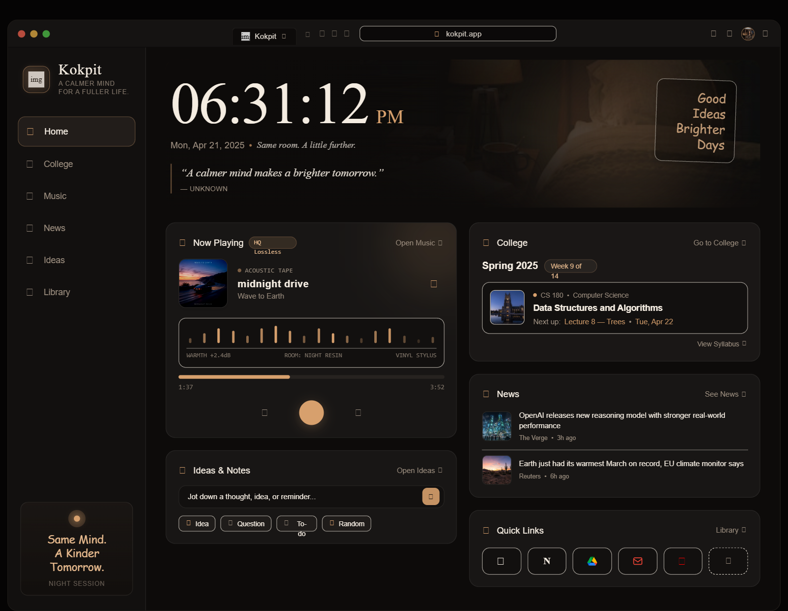
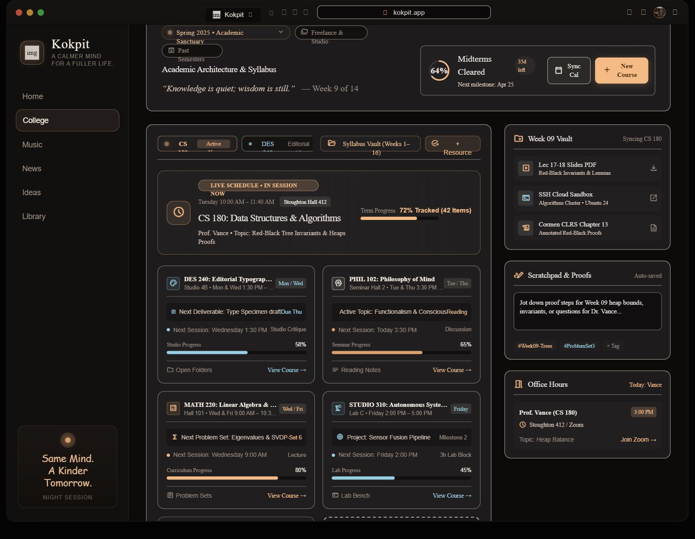
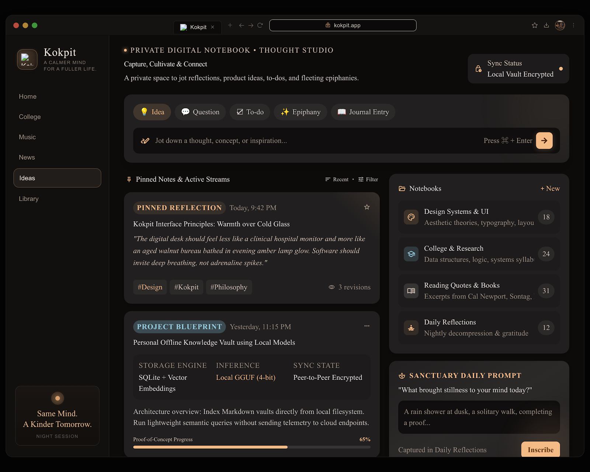
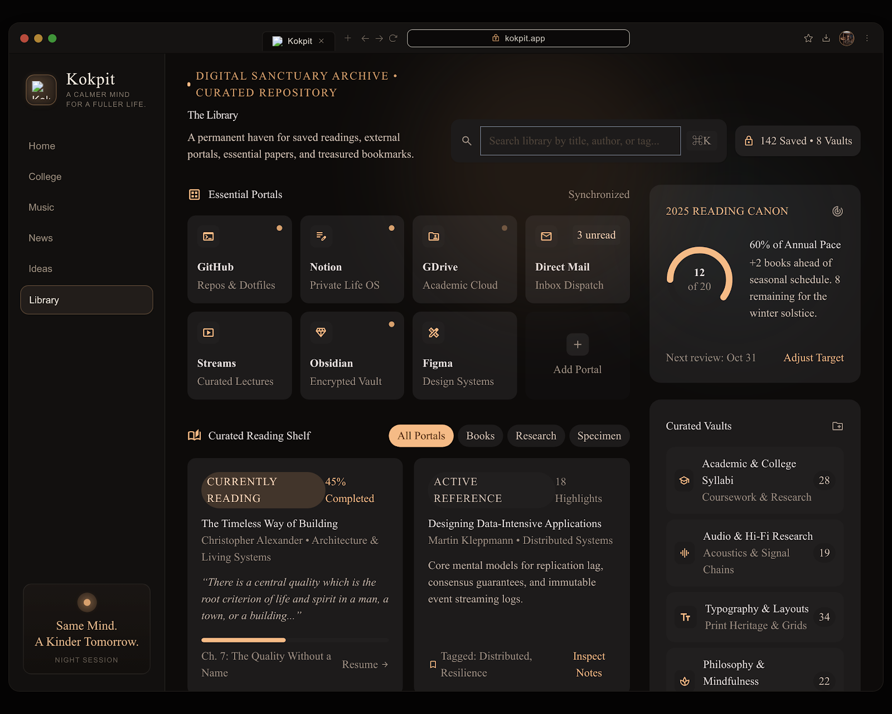
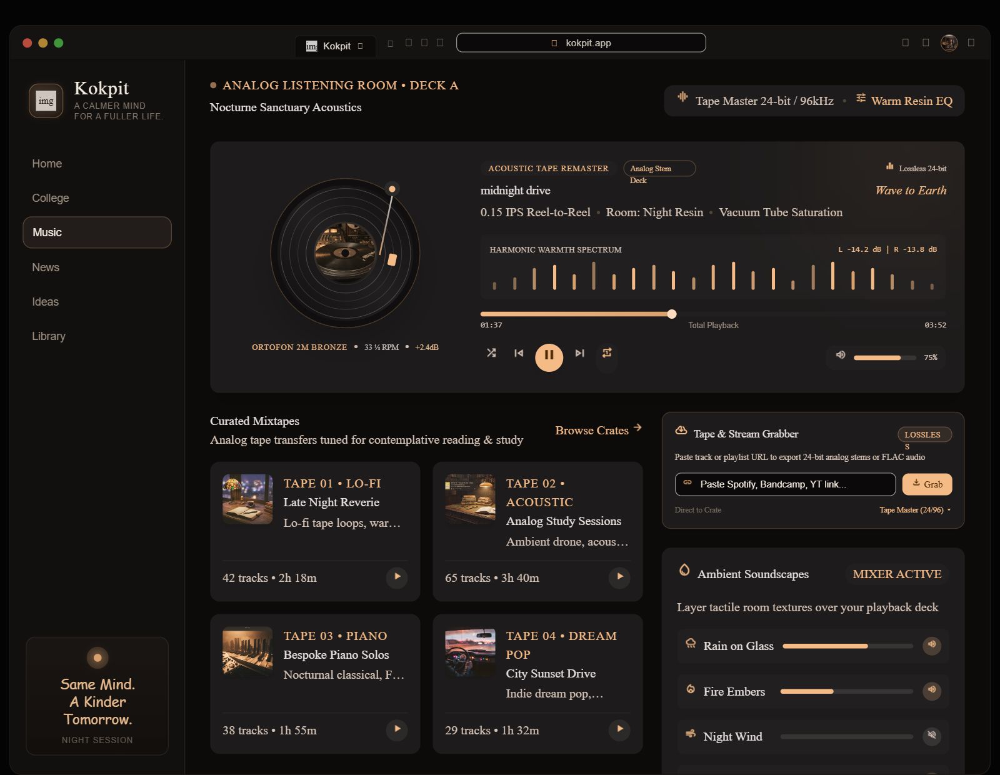
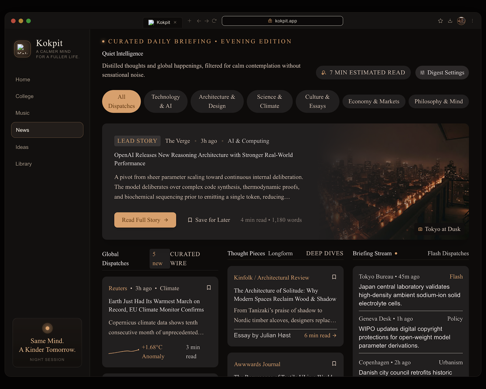
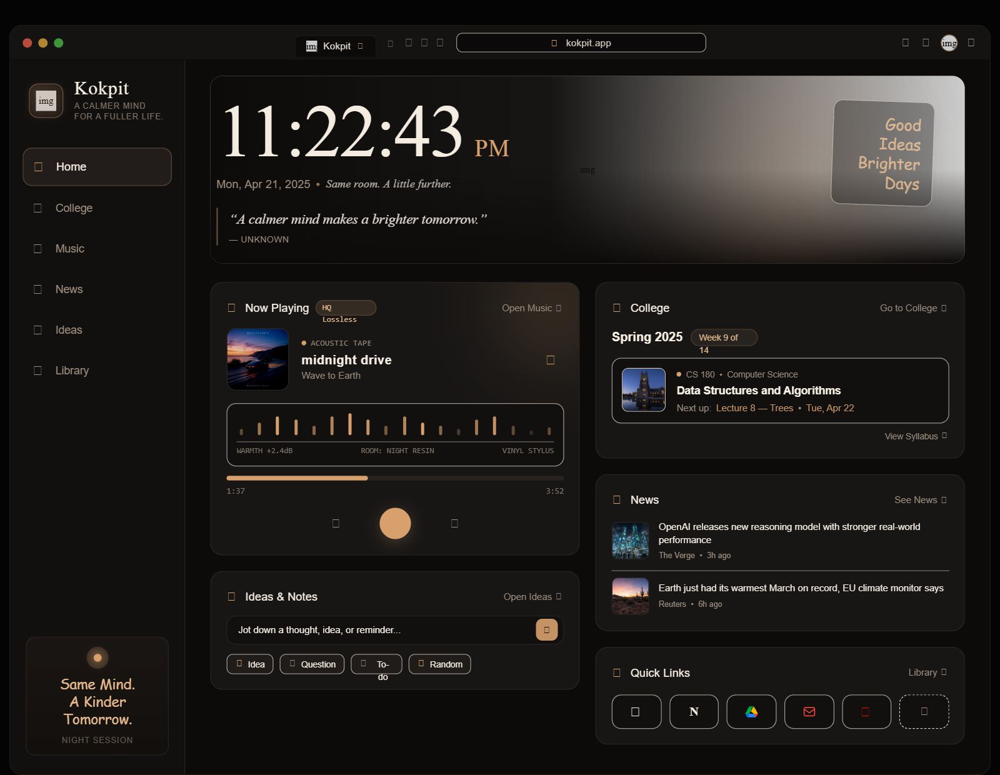

# Kokpit — UI References

**Status:** Owner-approved visual direction; implementation pending
**Received:** 2026-10-10 | **Source:** Owner-supplied Google Stitch screenshots

Use these screens to make Kokpit recognizable: warm charcoal, cream text, copper accents,
a spacious clock hero, a persistent sidebar, rounded surfaces, and distinct feature-page
compositions. The owner requested a similar UI with cleaner spacing, typography, and details.
The [Design System](DESIGN_SYSTEM.md) defines the normalized implementation; the
[PRD](../product/PRD.md) defines behavior. See [DEC-051](../product/DECISIONS.md#dec-051--stitch-visual-references-and-refined-v1-layouts).

These are design references, not screenshots of implemented Kokpit. Browser chrome,
broken images, missing-icon squares, sample content, and capability claims must not be
copied into the app. The PNGs are retained unchanged for comparison; they are documentation
assets, not runtime images or an asset pack for extracting album covers/logos/photos.

## Screen map

| Screen | Repository asset | Original attachment | Dimensions |
| --- | --- | --- | --- |
| Home — primary dark atmosphere | [home.png](references/home.png) | `screen.png` | 1600 × 1240 |
| College | [college.png](references/college.png) | `screen (1).png` | 1600 × 1240 |
| Ideas | [ideas.png](references/ideas.png) | `screen (2).png` | 1600 × 1280 |
| Library | [library.png](references/library.png) | `screen (3).png` | 1600 × 1280 |
| Music | [music.png](references/music.png) | `screen (4).png` | 1600 × 1240 |
| News | [news.png](references/news.png) | `screen (5).png` | 1600 × 1280 |
| Home — alternate composition | [home-alternate.png](references/home-alternate.png) | `screen (6).png` | 1600 × 1240 |

## Visual analysis and adjustments

| Aspect | Reference observation | Implementation direction |
| --- | --- | --- |
| Palette | Warm near-black backgrounds and cream text; Home/News use darker copper while other pages lean toward lighter peach. | Retain the semantic charcoal/copper palette. Avoid assigning separate themes to individual modules or sampling arbitrary PNG pixels as CSS values. |
| Shell | Sidebar occupies roughly 280px at a 1600px viewport; content has about 40px horizontal breathing room. | Use the revised large-desktop geometry in Design System and narrower overrides on smaller laptops. Exclude the browser frame. |
| Surfaces | Main cards have approximately 18–22px corner radii and 24px separation. College has many nested outlines. | Use existing radius tokens; retain spacious separation and replace unnecessary nested cards with dividers. |
| Typography | Home balances serif expression and sans-serif controls. Feature pages use serif more widely; some decorative text looks handwritten. | Keep Cormorant Garamond + Inter and their documented roles. Use Inter for readable functional content; add no third font. |
| Hierarchy | A prominent Home clock and full-width feature headers establish each room. | Preserve distinct page compositions without adding panels solely to fill the reference layout. |
| Icons and images | Several glyphs/images are missing; some pills and labels wrap awkwardly or clip. | Use proper labeled icons, real permitted assets, neutral fallbacks, flexible text, and controls sized for interaction. |
| States | Only populated desktop states are supplied. | Design loading, empty, error, keyboard focus, and responsive behavior through Design System; the screenshots do not prove those states work. |

## Mapping to V1

The following mapping keeps the supplied appearance useful within the documented product.
Reference-only items below are not an approved backlog or additional package requirements.
If the owner later requests them, resolve the relevant PRD, data, provider, and privacy
contracts before implementation.

| Page | Preserve in the V1 layout | Adapt or omit from the raw reference |
| --- | --- | --- |
| Home | Large clock/date/quote hero; left Music/Ideas and right College/News/Quick Links highlights. | Add required volume and **another thought**. Use real material context rather than a timetable. Replace bright/broken hero imagery and fabricated quote attribution; omit unsupported audio-processing claims and task controls. |
| College | Semester context, course grid, weekly resources, material actions. | Calendar sync, live schedules, deadlines, midterm/course progress, office hours, freelance workspace, and autosaved scratchpad are outside the current material-organizer contract. A week count must come from the course, not a fixed fourteen-week rule. |
| Ideas | Immediate composer, optional quick tags, readable saved/pinned ideas, dates and previews. | Make required search visible. Notebooks, journal prompts, revision history, and project-progress controls are not current V1 workflows. Do not claim a local encrypted vault or sync subsystem. Technology described inside an example idea is content, not Kokpit architecture. |
| Library | Portal grid, icon/name, add tile, optional shortcut grouping. | Reading shelf, book/highlight vaults, chapter progress, annual goals, and unread-mail integration are outside Quick Links. Existing shortcut favorites and ordering remain supported. |
| Music | Main player, artwork, transport, seek/time, volume, playlists and library. | Provide personal-file import. Tape remastering, hardware/codec claims, EQ/saturation, ambient layering, and stream grabbing/transcoding are not native-player capabilities. A vinyl visual may be restrained decoration. |
| News | Lead article, category filters, source/time, short summary, original link, supporting feed. | Use approved coverage/sources. Bookmarks, digest settings, fabricated reading/statistical metrics, and copied full publisher articles are not defined V1 behavior. Imagery must be relevant or clearly a neutral fallback. |

## Original screens

Home — primary dark atmosphere

College

Ideas

Library

Music

News

Home — alternate; bright hero placeholder is not the target treatment

