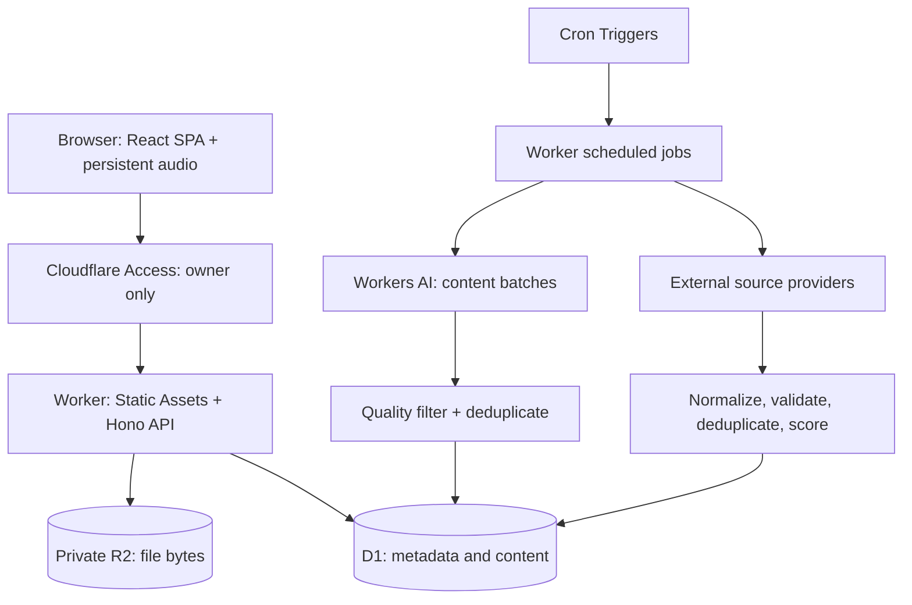
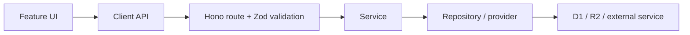
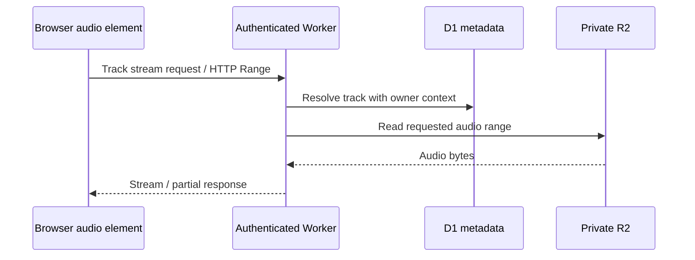

# Kokpit — Architecture

**Version:** 0.2 · **Status:** V1 Architecture Draft · **Updated:** 2026-10-07

Private single-user workspace, one repository, one logical Cloudflare deployment.
This document owns system boundaries; it does not redefine product or visual requirements.

| Source | Responsibility |
|---|---|
| [PRD](../product/PRD.md) | Product and V1 scope |
| [Design System](../design/DESIGN_SYSTEM.md) | Visual tokens and interaction rules |
| [Data Model](DATA_MODEL.md) | Persisted entities, fields and relationships |
| [Content Sources](../features/CONTENT_SOURCES.md) | Quotes, news and provider strategy |
| [File Structure](FILE_STRUCTURE.md) | Directory responsibilities |
| [Deployment](DEPLOYMENT.md) | Environments, bindings, migrations and operations |
| [Implementation Plan](../planning/IMPLEMENTATION_PLAN.md) | Authorized phase boundaries |
| [AGENTS.md](../../AGENTS.md) | Mandatory workflow and source precedence |

## Locked stack

| Layer | V1 choice |
|---|---|
| Client | React + strict TypeScript + Vite; SPA without SSR |
| Navigation | React Router |
| Styling | Tailwind CSS + Kokpit CSS custom properties |
| Server state | TanStack Query |
| Session/UI state | React Context or a small local store |
| HTTP runtime | Cloudflare Workers + Hono + TypeScript |
| Boundary validation | Zod |
| Structured storage | Cloudflare D1 + Drizzle ORM |
| File bytes | Private Cloudflare R2 |
| Private gate | Cloudflare Access |
| Background jobs | Cloudflare Cron Triggers |
| Content AI | Workers AI; cached/batched, optional to basic functionality |
| Deployment | Workers + Static Assets through Cloudflare Vite integration |

Cloudflare Vite integration starts at Phase 1.4. The Phase 1.3 scaffold alone does not
provide a Worker, remote resources or deployment readiness.
Production frontend and `/api/*` share an origin and deploy together.
Use Workers Static Assets, not legacy Workers Sites.



## Frontend composition

Feature boundaries are `home`, `college`, `music`, `news`, `ideas`, `library`.
Feature code starts in `src/features/`; shared primitives in `src/components/`;
application composition in `src/app/`; generic infrastructure in `src/lib/`.
Move code to shared only after a second genuine use.

React Router keeps the shell, sidebar, providers and music engine mounted across navigation.
Conceptual page routes (exact supporting route names are implementation details):

| Page | Route |
|---|---|
| Home | `/` or `/home` |
| College | `/college` |
| Music | `/music` |
| News | `/news` |
| Ideas | `/ideas` |
| Library | `/library` |

College may nest semester/course/week paths; Music may nest playlist paths.
Lazy-load deeper feature routes where useful. Home reads lightweight summaries from their
own modules; it must not import complete College management or Music library functionality.

Use custom lightweight components, native semantic controls and Lucide where needed.
Tailwind utilities must reference semantic Kokpit tokens, not establish a second raw palette.
No pre-styled theme or large UI framework is required.
Accessibility and loading/empty/error states follow the Design System.

| State | Owner |
|---|---|
| Ideas, links, College, music metadata, playlists, news, quotes, settings | API + D1; TanStack Query fetch/cache/invalidate |
| Playing track, queue, volume, player events | Persistent client provider above routes |
| Sidebar, selections, modal/form state | Local React state/context |
| Small non-critical preferences | Browser storage where appropriate |

LocalStorage is not a database for content, files, playlists or news.
No Redux is needed. Do not continuously persist audio position or clock ticks.

## HTTP and business logic

Use a same-origin JSON REST API with predictable status codes and Kokpit-owned contracts.
Explicit `/api/v1` versioning is unnecessary while private client and API deploy together.
The browser never directly queries D1 or receives privileged provider/storage credentials.



Simple operations need only the layers that clarify responsibility; avoid ceremony.
Hono owns HTTP routing, not large embedded business workflows.
External provider logic belongs in `worker/providers/`, normalized before database/API use.
Drizzle schema and queries belong in the database layer; focused raw SQL is acceptable.

Conceptual API groups include system, quotes, news, ideas, links, College hierarchy,
materials, tracks, playlists and files. Exact endpoint names can be simplified during implementation.
Validate route/query parameters, request bodies, URLs, filenames, file metadata, MIME claims
and external feeds with Zod. Never trust browser or provider input.

Errors use structured safe JSON, for example:

```json
{"error":{"code":"RESOURCE_NOT_FOUND","message":"Material not found."}}
```

Do not expose stack traces, SQL internals, secrets or Cloudflare credentials.
Feature errors remain local and recoverable where possible.

## Identity and authorization

V1 has one seeded owner. Cloudflare Access is the private gate: deny by default,
allow the owner identity only, using permitted email/One-Time PIN or an identity provider.
There is no custom login, registration, account switching, team or public profile in V1.
A secret URL or obscure hostname is not security.

Access covers frontend, API and file/audio routes. It does not replace application authorization:
resolve owner context and scope every personal resource lookup by `user_id`, including nested resources.

```sql
SELECT * FROM ideas WHERE id = ? AND user_id = ?;
```

Keep ownership on security-sensitive records even when inferable through a parent.
Future public accounts would require a separate authentication review; data readiness does not authorize public behavior.

## D1, R2 and uploads

D1 stores metadata and relationships. R2 stores audio, artwork, College PDFs/slides/documents/images.
The [Data Model](DATA_MODEL.md) is the precise 17-table contract.

- Keep R2 private; no unrestricted browser bucket access or public file URLs.
- Generate object keys in the backend; never trust complete keys supplied by clients.
- Store original filename separately for display; sanitize untrusted names.
- Upload through the Worker to R2 for V1 simplicity.
- Enforce **50 MB per file**; validate allowed type, declared/actual size, metadata and destination ownership.
- Large-file presigned/multipart flows are future work requiring a real need and review.

File access resolves metadata → verifies ownership → reads R2 → streams bytes.
A conceptual file route is `GET /api/files/:id`; guessing an object key grants no access.
Keep replacement and deletion consistent across storage layers; follow canonical lifecycle rules in Data Model.
SQL cascades cannot remove R2 bytes. Retry partial cleanup safely and avoid orphan accumulation.

## Persistent music

Use native `HTMLAudioElement` capabilities; no custom codec engine.
The provider lives above routed pages so navigation does not interrupt playback.



Support HTTP Range requests for seeking, stream rather than preload full files.
V1's core is owned uploads, library, playlists and playback.
Unofficial YouTube/TikTok/Instagram scraping is not a core dependency;
future external imports must be reliable, legally appropriate and optional.

## Content pipelines

The same Worker exposes `fetch()` for requests and `scheduled()` for jobs.
Cron refreshes news, refills a low quote pool and cleans stale content;
not every job must run on every invocation. Avoid separate Workers without operational need.

| Pipeline | Required behavior |
|---|---|
| News | Approved source adapters → normalize → validate → deduplicate → relevance score → optional AI → D1 → API |
| Quotes | Workers AI batch → quality filter → deduplicate → D1 pool → stable local-hour selection API |

News providers, accepted feeds, relevance inputs and schedules remain in Content Sources.
Initial refresh is 30–60 minutes; Deployment recommends a 30-minute base Cron.
Keep original source URLs. AI may summarize/classify/explain relevance, but source headline,
description and basic scoring must work without it. Filter first, enrich selected top articles second.
Source failures must preserve cached articles and allow other sources to continue.

Quotes target approximately 90% English / 10% Indonesian and normally have no AI author.
No fabricated attribution, generic motivational array, or AI call on every page load.
Select by `user_settings.timezone`; primary quote changes at local clock-hour boundaries and remains stable within the hour.
The required secondary `another thought` action does not replace the scheduled primary selection.
Fallback order: eligible cached quote → previously stored quote → small emergency set.
The fallback pool is for reliability, not the primary experience.
Workers AI receives only approved general context, never private ideas, notes, files or listening history.

## Reliability, caching and performance

| Failure | Isolation |
|---|---|
| AI unavailable/quota exhausted | Cached quotes and basic news remain usable |
| One malformed/down feed | Other sources still refresh |
| File upload fails | Unrelated features remain usable |
| News refresh fails | Render existing normalized cache |

Use static asset caching, D1 news/quote pools, frontend query cache and appropriate browser HTTP cache.
Private responses must preserve Access/ownership boundaries; do not create shared cache paths that leak personal data.
No KV is required without demonstrated benefit.
Keep Home fast, use thumbnails, lazy feature routes, streamed audio and minimal dependencies.
Clock uses client timers, progress uses audio events; neither needs realtime infrastructure.

Log unexpected API failures, job/source failures and file-operation failures through native Worker logs.
Never log private contents, tokens, secrets, signed URLs or audio/document bytes.
Third-party observability infrastructure is unnecessary in V1.

## Environments, changes and recovery

Support local and production; preview/staging only when risk justifies it.
Cloudflare tooling should emulate local bindings; never require production D1 data for development.
Secrets belong in Cloudflare bindings/Wrangler secrets or ignored local files.
Client environment variables are public; privileged third-party calls stay server-side.

Schema changes use version-controlled migrations, local application and tests before production.
Update Drizzle schema and Data Model for material changes; review compatibility and never rewrite applied history.
Recovery covers D1 native recovery/export, R2 inventory/files, critical configuration and Git.
The operational runbook is [Deployment](DEPLOYMENT.md).

Test pure business logic, critical API/ownership/database behavior, important UI interactions and end-to-end smoke flows.
Priority flows: open Kokpit, save idea, open link, upload material, play/seek audio,
navigate while music continues, and load cached news/quotes.
Run relevant lint, typecheck, build and tests; visually check UI where changed.

## Infrastructure and dependency limits

Prefer fewer moving parts, Cloudflare-native services and low-volume personal costs.
Cache, batch and schedule expensive inference/provider work.
Add a package only when platform/existing APIs are insufficient; avoid duplicate date/state/UI/validation tools.

Excluded without explicit architecture revision: Next.js/SSR, traditional VPS/Node server,
Express, Docker production, Kubernetes, Redis, MongoDB, Firebase, Supabase,
WebSockets, Durable Objects, microservices, message queues and separate search servers.
New databases/ORMs/validators/frameworks require review under AGENTS.md.
Public auth/billing, collaboration, semantic search, embeddings/RAG and larger upload flows are future possibilities, not V1 requirements.
