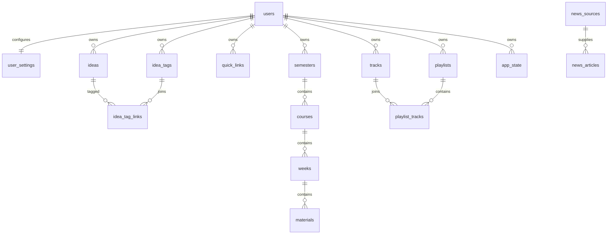

# Kokpit — Data Model

**Version:** 0.2 · **Status:** V1 Data Model Draft · **Updated:** 2026-10-07

Canonical persisted schema for private single-user V1: **17 D1 tables**.
D1 stores structured metadata; private R2 stores file bytes.
Runtime boundaries: [Architecture](ARCHITECTURE.md). Operations: [Deployment](DEPLOYMENT.md).
Accepted preflight changes: [DEC-048](../product/DECISIONS.md#dec-048--owner-approved-preflight-resolutions).

## Conventions and ownership

- Application-generated opaque UUIDs use `TEXT` primary keys unless stated otherwise.
- Timestamps use ISO 8601 UTC strings; display timezone belongs in settings.
- `Required = yes` means non-null; `no` means nullable. Defaults below retain the original specification's suggested defaults, rather than introducing new ones.
- SQLite booleans are `INTEGER`: `0` false, `1` true; ORM may expose booleans.
- Enable real foreign keys. Every FK listed below has `ON DELETE CASCADE`.
- One seeded owner exists; public registration and account switching are outside V1.
- Query personal resources with both ID and `user_id`, including nested resources.
- Validate parent/child ownership; join-table operations must validate both related owners.
- Quotes and news are shared content pools in V1, without personal `user_id` fields.
- Explicit `position` orders links, semesters, courses, materials, playlists and memberships; integer spacing such as 100/200 is suggested, algorithm remains an implementation detail.
- JSON is for tiny flexible state or unqueried provider metadata, never relational collections.



The diagram emphasizes hierarchy; courses, weeks and materials also have explicit owner FKs.
Quotes form an independent content pool. SQL cascades never delete R2 objects.

## Table contracts

Every table below preserves its fields, SQL types, nullability, constraints and index definitions.
Constraints are shown compactly; the global cascade convention applies to each FK.

### `users`

| Field | Type | Required | Description |
|---|---|---:|---|
| `id` | TEXT | yes | Primary key |
| `email` | TEXT | yes | Owner email / future account identity |
| `display_name` | TEXT | yes | Display name |
| `role` | TEXT | yes | V1 value: `owner` |
| `created_at` | TEXT | yes | UTC creation timestamp |
| `updated_at` | TEXT | yes | UTC last update timestamp |

**Constraints:** `PRIMARY KEY (id) UNIQUE (email)`.

### `user_settings`

| Field | Type | Required | Description |
|---|---|---:|---|
| `user_id` | TEXT | yes | Primary key + FK to users |
| `timezone` | TEXT | yes | Example: `Asia/Jakarta` |
| `locale` | TEXT | yes | Example: `id-ID` |
| `clock_format` | TEXT | yes | `12h` or `24h` |
| `quote_rotation_minutes` | INTEGER | yes | Fixed V1 value: `60`; local clock-hour rotation, not a configurable preference |
| `news_refresh_preference_minutes` | INTEGER | no | UI preference, not necessarily cron schedule |
| `music_volume` | REAL | yes | `0.0` to `1.0` |
| `sidebar_collapsed` | INTEGER | yes | SQLite boolean, `0` or `1` |
| `created_at` | TEXT | yes | UTC |
| `updated_at` | TEXT | yes | UTC |

**Constraints:** `PRIMARY KEY (user_id) FOREIGN KEY (user_id) REFERENCES users(id) ON DELETE CASCADE`.

**Defaults:** `timezone = Asia/Jakarta locale = id-ID clock_format = 24h quote_rotation_minutes = 60 music_volume = 0.70 sidebar_collapsed = 0`.

### `ideas`

| Field | Type | Required | Description |
|---|---|---:|---|
| `id` | TEXT | yes | Primary key |
| `user_id` | TEXT | yes | Owner |
| `title` | TEXT | no | Optional idea title |
| `content` | TEXT | yes | Idea body |
| `is_pinned` | INTEGER | yes | `0` or `1` |
| `created_at` | TEXT | yes | UTC |
| `updated_at` | TEXT | yes | UTC |

**Constraints:** `PRIMARY KEY (id) FOREIGN KEY (user_id) REFERENCES users(id) ON DELETE CASCADE`.

**Indexes:** `INDEX ideas_user_created_idx (user_id, created_at DESC) INDEX ideas_user_pinned_idx (user_id, is_pinned, created_at DESC)`.

### `idea_tags`

| Field | Type | Required | Description |
|---|---|---:|---|
| `id` | TEXT | yes | Primary key |
| `user_id` | TEXT | yes | Owner |
| `name` | TEXT | yes | Tag name |
| `created_at` | TEXT | yes | UTC |

**Constraints:** `PRIMARY KEY (id) UNIQUE (user_id, name) FOREIGN KEY (user_id) REFERENCES users(id) ON DELETE CASCADE`.

### `idea_tag_links`

| Field | Type | Required | Description |
|---|---|---:|---|
| `idea_id` | TEXT | yes | FK to ideas |
| `tag_id` | TEXT | yes | FK to idea_tags |

**Constraints:** `PRIMARY KEY (idea_id, tag_id) FOREIGN KEY (idea_id) REFERENCES ideas(id) ON DELETE CASCADE FOREIGN KEY (tag_id) REFERENCES idea_tags(id) ON DELETE CASCADE`.

### `quick_links`

| Field | Type | Required | Description |
|---|---|---:|---|
| `id` | TEXT | yes | Primary key |
| `user_id` | TEXT | yes | Owner |
| `name` | TEXT | yes | Display label |
| `url` | TEXT | yes | Destination URL |
| `icon_type` | TEXT | yes | `brand`, `lucide`, `favicon`, or `custom` |
| `icon_value` | TEXT | no | Icon identifier / URL / object reference |
| `group_name` | TEXT | no | Optional grouping |
| `position` | INTEGER | yes | Explicit ordering |
| `is_favorite` | INTEGER | yes | Whether highlighted on Home |
| `created_at` | TEXT | yes | UTC |
| `updated_at` | TEXT | yes | UTC |

**Constraints:** `PRIMARY KEY (id) FOREIGN KEY (user_id) REFERENCES users(id) ON DELETE CASCADE`.

**Indexes:** `INDEX quick_links_user_position_idx (user_id, position) INDEX quick_links_user_favorite_idx (user_id, is_favorite, position)`.

### `semesters`

| Field | Type | Required | Description |
|---|---|---:|---|
| `id` | TEXT | yes | Primary key |
| `user_id` | TEXT | yes | Owner |
| `name` | TEXT | yes | Display name |
| `academic_year` | TEXT | no | Example: `2026/2027` |
| `term_number` | INTEGER | no | Example: `5` |
| `is_active` | INTEGER | yes | Active semester flag |
| `position` | INTEGER | yes | Ordering |
| `created_at` | TEXT | yes | UTC |
| `updated_at` | TEXT | yes | UTC |

**Constraints:** `PRIMARY KEY (id) FOREIGN KEY (user_id) REFERENCES users(id) ON DELETE CASCADE`.

**Indexes:** `INDEX semesters_user_position_idx (user_id, position) INDEX semesters_user_active_idx (user_id, is_active)`.

### `courses`

| Field | Type | Required | Description |
|---|---|---:|---|
| `id` | TEXT | yes | Primary key |
| `user_id` | TEXT | yes | Owner |
| `semester_id` | TEXT | yes | Parent semester |
| `name` | TEXT | yes | Course name |
| `code` | TEXT | no | Course code |
| `lecturer` | TEXT | no | Lecturer display name |
| `accent_key` | TEXT | no | Optional restrained UI identifier |
| `position` | INTEGER | yes | Ordering |
| `created_at` | TEXT | yes | UTC |
| `updated_at` | TEXT | yes | UTC |

**Constraints:** `PRIMARY KEY (id) FOREIGN KEY (user_id) REFERENCES users(id) ON DELETE CASCADE FOREIGN KEY (semester_id) REFERENCES semesters(id) ON DELETE CASCADE`.

**Indexes:** `INDEX courses_semester_position_idx (semester_id, position) INDEX courses_user_semester_idx (user_id, semester_id)`.

### `weeks`

| Field | Type | Required | Description |
|---|---|---:|---|
| `id` | TEXT | yes | Primary key |
| `user_id` | TEXT | yes | Owner |
| `course_id` | TEXT | yes | Parent course |
| `week_number` | INTEGER | yes | Week sequence |
| `title` | TEXT | no | Optional descriptive title |
| `notes` | TEXT | no | Small optional context note |
| `created_at` | TEXT | yes | UTC |
| `updated_at` | TEXT | yes | UTC |

**Constraints:** `PRIMARY KEY (id) UNIQUE (course_id, week_number) FOREIGN KEY (user_id) REFERENCES users(id) ON DELETE CASCADE FOREIGN KEY (course_id) REFERENCES courses(id) ON DELETE CASCADE`.

**Indexes:** `INDEX weeks_course_number_idx (course_id, week_number) INDEX weeks_user_course_idx (user_id, course_id)`.

### `materials`

| Field | Type | Required | Description |
|---|---|---:|---|
| `id` | TEXT | yes | Primary key |
| `user_id` | TEXT | yes | Owner |
| `week_id` | TEXT | yes | Parent week |
| `type` | TEXT | yes | `file` or `link` |
| `title` | TEXT | yes | Display title |
| `original_filename` | TEXT | no | Original uploaded filename |
| `mime_type` | TEXT | no | File MIME type |
| `size_bytes` | INTEGER | no | File size |
| `r2_key` | TEXT | no | Private R2 object key |
| `external_url` | TEXT | no | Used when type is `link` |
| `position` | INTEGER | yes | Ordering within week |
| `created_at` | TEXT | yes | UTC |
| `updated_at` | TEXT | yes | UTC |
| `last_opened_at` | TEXT | no | Optional recent-access metadata |

**Constraints:** `PRIMARY KEY (id) FOREIGN KEY (user_id) REFERENCES users(id) ON DELETE CASCADE FOREIGN KEY (week_id) REFERENCES weeks(id) ON DELETE CASCADE`.

**Indexes:** `INDEX materials_week_position_idx (week_id, position) INDEX materials_user_week_idx (user_id, week_id) INDEX materials_last_opened_idx (user_id, last_opened_at DESC)`.

### `tracks`

| Field | Type | Required | Description |
|---|---|---:|---|
| `id` | TEXT | yes | Primary key |
| `user_id` | TEXT | yes | Owner |
| `title` | TEXT | yes | Track title |
| `artist` | TEXT | no | Artist |
| `album` | TEXT | no | Album |
| `duration_seconds` | REAL | no | Duration |
| `audio_r2_key` | TEXT | yes | Private audio object key |
| `audio_mime_type` | TEXT | yes | MIME type |
| `audio_size_bytes` | INTEGER | yes | File size |
| `cover_r2_key` | TEXT | no | Optional private cover image |
| `source_type` | TEXT | yes | Example: `upload` |
| `source_reference` | TEXT | no | Optional future import reference |
| `is_favorite` | INTEGER | yes | Favorite flag |
| `created_at` | TEXT | yes | UTC |
| `updated_at` | TEXT | yes | UTC |
| `last_played_at` | TEXT | no | Last playback time |
| `play_count` | INTEGER | yes | Lightweight playback count |

**Constraints:** `PRIMARY KEY (id) FOREIGN KEY (user_id) REFERENCES users(id) ON DELETE CASCADE`.

**Defaults:** `source_type = upload is_favorite = 0 play_count = 0`.

**Indexes:** `INDEX tracks_user_created_idx (user_id, created_at DESC) INDEX tracks_user_favorite_idx (user_id, is_favorite) INDEX tracks_user_last_played_idx (user_id, last_played_at DESC)`.

### `playlists`

| Field | Type | Required | Description |
|---|---|---:|---|
| `id` | TEXT | yes | Primary key |
| `user_id` | TEXT | yes | Owner |
| `name` | TEXT | yes | Playlist name |
| `description` | TEXT | no | Optional |
| `cover_r2_key` | TEXT | no | Optional custom cover |
| `position` | INTEGER | yes | Ordering |
| `created_at` | TEXT | yes | UTC |
| `updated_at` | TEXT | yes | UTC |

**Constraints:** `PRIMARY KEY (id) FOREIGN KEY (user_id) REFERENCES users(id) ON DELETE CASCADE`.

**Indexes:** `INDEX playlists_user_position_idx (user_id, position)`.

### `playlist_tracks`

| Field | Type | Required | Description |
|---|---|---:|---|
| `playlist_id` | TEXT | yes | Parent playlist |
| `track_id` | TEXT | yes | Track |
| `position` | INTEGER | yes | Order inside playlist |
| `added_at` | TEXT | yes | UTC |

**Constraints:** `PRIMARY KEY (playlist_id, track_id) FOREIGN KEY (playlist_id) REFERENCES playlists(id) ON DELETE CASCADE FOREIGN KEY (track_id) REFERENCES tracks(id) ON DELETE CASCADE`.

**Indexes:** `INDEX playlist_tracks_order_idx (playlist_id, position)`.

### `news_sources`

| Field | Type | Required | Description |
|---|---|---:|---|
| `id` | TEXT | yes | Primary key |
| `name` | TEXT | yes | Source name |
| `type` | TEXT | yes | `rss`, `atom`, or `api` |
| `feed_url` | TEXT | no | Source feed endpoint |
| `site_url` | TEXT | no | Human-facing site |
| `category` | TEXT | no | Example: `technology`, `world`, `ai` |
| `priority` | INTEGER | yes | Source weighting |
| `is_enabled` | INTEGER | yes | Source enabled flag |
| `last_fetched_at` | TEXT | no | Last successful/attempted refresh |
| `created_at` | TEXT | yes | UTC |
| `updated_at` | TEXT | yes | UTC |

**Constraints:** `PRIMARY KEY (id)`.

**Defaults:** `priority = 50 is_enabled = 1`.

**Indexes:** `INDEX news_sources_enabled_idx (is_enabled, priority DESC)`.

### `news_articles`

| Field | Type | Required | Description |
|---|---|---:|---|
| `id` | TEXT | yes | Primary key |
| `source_id` | TEXT | yes | Source |
| `external_id` | TEXT | no | Provider-specific ID if available |
| `dedup_key` | TEXT | yes | Stable duplicate-detection key |
| `title` | TEXT | yes | Normalized headline |
| `summary` | TEXT | no | Source summary or generated summary |
| `why_it_matters` | TEXT | no | Optional AI enrichment |
| `url` | TEXT | yes | Original article URL |
| `image_url` | TEXT | no | Remote thumbnail URL |
| `category` | TEXT | no | Normalized category |
| `relevance_score` | REAL | yes | Kokpit relevance |
| `published_at` | TEXT | no | Original publication time |
| `fetched_at` | TEXT | yes | Ingestion time |
| `ai_enriched` | INTEGER | yes | Whether AI enrichment was used |
| `created_at` | TEXT | yes | UTC |

**Constraints:** `PRIMARY KEY (id) UNIQUE (dedup_key) FOREIGN KEY (source_id) REFERENCES news_sources(id) ON DELETE CASCADE`.

**Defaults:** `relevance_score = 0 ai_enriched = 0`.

**Indexes:** `INDEX news_articles_feed_idx (relevance_score DESC, published_at DESC) INDEX news_articles_source_idx (source_id, published_at DESC) INDEX news_articles_category_idx (category, published_at DESC)`.

### `quotes`

| Field | Type | Required | Description |
|---|---|---:|---|
| `id` | TEXT | yes | Primary key |
| `content` | TEXT | yes | Quote / thought |
| `mood` | TEXT | yes | Mood category |
| `language` | TEXT | yes | Quote language: `en` or `id` |
| `source_type` | TEXT | yes | `ai`, `external`, or `fallback` |
| `author` | TEXT | no | Only when verified |
| `source_url` | TEXT | no | Optional source attribution |
| `content_hash` | TEXT | yes | Duplicate detection |
| `is_active` | INTEGER | yes | Eligible for rotation |
| `created_at` | TEXT | yes | UTC |
| `last_shown_at` | TEXT | no | Last display time |
| `show_count` | INTEGER | yes | Number of displays |

**Constraints:** `PRIMARY KEY (id) UNIQUE (content_hash) CHECK (language IN ('en', 'id'))`.

**Defaults:** `is_active = 1 show_count = 0`.

**Indexes:** `INDEX quotes_rotation_idx (is_active, last_shown_at, show_count) INDEX quotes_mood_idx (mood, is_active)`.

### `app_state`

| Field | Type | Required | Description |
|---|---|---:|---|
| `user_id` | TEXT | yes | Owner |
| `key` | TEXT | yes | State key |
| `value_json` | TEXT | yes | JSON-encoded value |
| `updated_at` | TEXT | yes | UTC |

**Constraints:** `PRIMARY KEY (user_id, key) FOREIGN KEY (user_id) REFERENCES users(id) ON DELETE CASCADE`.
## Validation and domain rules

| Domain | Contract |
|---|---|
| Settings | Suggested defaults: timezone `Asia/Jakarta`, locale `id-ID`, clock `24h`, rotation `60`, volume `0.70`, sidebar `0`. Rotation remains fixed in V1 and uses local clock-hour boundaries, never elapsed minutes after opening. |
| Ideas | Content must not be empty; title and lightweight tags are optional. |
| Links | `group_name` is optional; no normalized groups table is needed in V1. Validate destination URLs and icon references. |
| Semesters | Normally one active semester per user; service-level enforcement is acceptable. |
| Weeks | Number of weeks is not globally fixed; `(course_id, week_number)` is unique. |
| Materials | `file` requires `r2_key`, `original_filename`, `mime_type`, `size_bytes`; `link` requires `external_url`. A record must not behave as both. |
| Playlists | A track occurs once per playlist due to the composite PK; duplicate occurrences are outside V1. |
| News | Preserve original article URL/source; enrichment remains optional. |
| Quotes | Every AI, external or fallback quote carries `language` (`en` or `id`); target approximately 90% English and 10% Indonesian over time, never infer language from UI locale. |
| Attribution | AI author normally `NULL`; never fabricate authors. External author/source URL are stored only when reliable. |
| App state | Use sparingly, e.g. `last_opened_course_id`, `last_selected_news_filter`; do not hide ordinary entities here. |

Suggested quote moods: `calm`, `reflective`, `ambition`, `struggle`, `sad`, `uncertain`,
`hopeful`, `creative`, `technology`, `life`, `late-night`. Keep this lightweight.

`dedup_key` comes from normalized canonical URL or normalized title + source.
Different coverage of one event is not automatically duplicate content; event clustering is outside V1.
News retention is configurable within the suggested **30–60 days** window;
[Implementation Plan](../planning/IMPLEMENTATION_PLAN.md) uses roughly **45 days** as the initial default.

## Files and deletion

The backend generates storage keys; authorization always comes from D1 ownership.
Store display filenames separately from private keys; sanitize names when needed and never accept
an untrusted original filename or complete client-provided key as a storage path.
Conceptual layout (examples, not separate authorization rules):

```text
users/{userId}/music/audio/{trackId}/{filename}
users/{userId}/music/covers/{trackId}/{filename}
users/{userId}/college/{courseId}/{weekId}/{materialId}/{filename}
users/{userId}/playlist-covers/{playlistId}/{filename}
```

Uploads have the approved **50 MB per file** limit; persist actual `size_bytes` / `audio_size_bytes`.
Validate owner, allowed type, declared and actual size, destination and metadata.
Files remain private and are resolved through authenticated metadata routes.
Audio delivery supports HTTP Range seeking; see [Architecture](ARCHITECTURE.md).

| Delete action | Required effect |
|---|---|
| Semester / course / week | Collect affected material R2 keys → delete objects → delete hierarchy; SQL cascades clear child metadata. Retry partial cleanup safely. |
| File material | Remove its object and metadata; SQL cascade alone cannot clean R2. |
| Track | Delete audio, uniquely owned optional cover and row; memberships cascade. |
| Playlist | Delete playlist, memberships and playlist-specific cover where applicable; retain tracks. |
| Replace file | Delete old object only after replacement is safely committed. |

Validate ownership and exact keys before any object deletion; avoid wildcard cleanup.
Real deletion is V1's default for ideas, links, playlists, courses, materials and tracks.
Broad soft delete, trash/restore and full revision/audit history are outside V1.

## Persistence limits and initial data

- Playback session stays in browser memory; do not write progress to D1 every second.
- Optional durable playback metadata is `last_played_at` / `play_count`; session resume is outside V1.
- Clock ticks, hover/dropdown/modal/loading states, unsaved forms and current route are transient.
- LocalStorage may store non-critical preferences, never canonical Kokpit content.
- Derive counts (playlist tracks, course materials, semester courses) instead of storing duplicates without a measured need.
- Ideas may use title/content `LIKE` or D1 FTS when useful; College searches names, titles and filenames. No external or universal search infrastructure in V1.
- Home has no `home_widgets` table; it composes existing feature summaries and playback state.
- Production seed: one owner, one settings row, approved news registry, small emergency quote pool.
- Never seed fake ideas, courses, tracks, playlists or personal files; isolate development fixtures.

## Schema change workflow

Follow [AGENTS.md](../../AGENTS.md) and [Deployment](DEPLOYMENT.md):
Drizzle schema → generated migration → SQL review → local apply → tests → deliberate production apply.
Keep migrations version-controlled and never rewrite applied history or manually change production schema.
Material changes also update this document and require compatibility review.
Unexpected entities or destructive changes require owner review before implementation.
