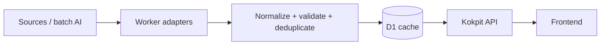
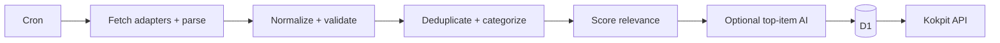

# Kokpit — Content Sources

**Version:** 0.2
**Status:** V1 Content Strategy Draft
**Product:** Kokpit · **Scope:** Quotes + News
**Runtime:** Workers · **Scheduling:** Cron Triggers · **Optional AI:** Workers AI
**Last Updated:** 2026-10-07

This is the canonical ingestion contract. [Architecture](../engineering/ARCHITECTURE.md) owns runtime boundaries; [Data Model](../engineering/DATA_MODEL.md) owns persisted fields; [Implementation Plan](../planning/IMPLEMENTATION_PLAN.md) owns execution order. This cleanup preserves approved behavior.

## Content flow and failure isolation

- Frontend reads normalized cached Kokpit contracts, not raw provider queries. Providers stay replaceable behind `QuoteProvider`, `NewsProvider`, and `AIProvider` boundaries.
- One source failure must not break Home or remaining sources. AI failure uses cached quotes, source metadata/excerpts, and deterministic news classification.
- Models remain configurable: initial quote provider `WorkersAIQuoteProvider.generateBatch(input)`; example configuration `QUOTE_AI_PROVIDER=workers-ai`, `QUOTE_AI_MODEL=<configured model>`.
- Replacing provider/model must not require database, frontend, or content API redesign. Workers AI is preferred, not a hard rendering dependency.

## Quotes: inventory and hourly behavior

Quotes are original short thoughts with emotional range, not constant motivation. Subjects may include life, studying, software building, frustration, curiosity, rest, loneliness, creativity, ambition, uncertainty, and light humor.

| Setting | V1 behavior / recommendation |
| --- | --- |
| Primary source | Workers AI batch generation → D1 `quotes`; never AI per page load |
| Language | ~90% English, ~10% Indonesian over time; not a quota per batch |
| Language metadata | Required `language`: `en` or `id`; natural single-language sentences, no forced mixing |
| Healthy inventory | 96–168 active quotes |
| Refill threshold | 72 eligible quotes |
| Refill batch | 24–48 quotes; tune for inference cost/output quality |
| Recent context | 20–40 recent generated/shown quote texts where practical; never the whole database |
| Length | Recommended 6–32 words; soft maximum 45 words |
| Emergency inventory | 5–10 built-in fallback thoughts, only when D1 is empty AND AI is unavailable |
| Rotation | Local clock-hour boundary using `user_settings.timezone` |
| Persisted interval | `user_settings.quote_rotation_minutes = 60`, fixed V1; no interval preference UI |
| `another thought` | Required V1 action, visually secondary; alternate eligible quote for current session |

The primary quote normally stays stable through refreshes within an hour (06:00–06:59 → A; 07:00–07:59 → B). Next-hour eligibility follows clock boundaries, not sixty elapsed minutes after opening Home. An invalidated quote is the exception. `another thought` never changes scheduled selection.

Selection considers `last_shown_at`, `show_count`, mood, language, time period, and recent mood sequence. Avoid runs of only sad or only developer quotes. Retain unused quality inventory; do not regenerate the pool daily or unnecessarily summarize/classify quotes.

### Mood vocabulary and suggested weighting

Each quote has one mood: `calm`, `reflective`, `ambition`, `struggle`, `sad`, `uncertain`, `hopeful`, `lonely`, `creative`, `life`, `student`, `developer`, `late-night`, `rest`, `curiosity`, `dry-humor`. Avoid dozens of overlapping categories.

| Local period | Suggested moods with more weight |
| --- | --- |
| Morning, 05:00–10:59 | calm, hopeful, curiosity, ambition |
| Daytime, 11:00–16:59 | developer, student, creative, struggle |
| Evening, 17:00–21:59 | reflective, life, rest, creative |
| Late-night, 22:00–04:59 | reflective, uncertain, lonely, calm, dry-humor |

These are soft weights, not rigid rules; late-night need not mean sad. Vary length, emotional intensity, structure, viewpoint, rhythm, mood, and subject. Use one sentence or two short sentences; avoid essays.

### Quality, deduplication, and attribution

Normalize each candidate and compute `content_hash`; reject exact duplicates before insert. Recent quote context reduces semantic repetition. Begin with deterministic quality checks; future AI scoring is optional.

Reject empty, overlong, repeated, malformed, boilerplate output; invented attribution; banned cliché openings; unsafe/unexpected formatting; and instructions masquerading as thoughts. Prompts must reject:

| Banned phrase | Banned phrase |
| --- | --- |
| believe in yourself | never give up |
| dream big | keep pushing |
| you've got this | success is a journey |
| be the best version of yourself | everything happens for a reason |
| trust the process | the sky is the limit |

Also reject corporate motivation, LinkedIn hustle, therapy reassurance, fake deep philosophy, repetitive “maybe...” structures, constant second-person commands, and fake famous-author quotes.

AI-generated quotes use `source_type = ai`, `author = NULL`; display no author or a subtle Kokpit-generated indicator. Named attribution requires genuine sourcing and verification.

Tone examples only; never a hardcoded primary production list:

> You can spend three hours fixing one stupid bug and still call the day useful.
>
> Not every unfinished thing is a failure. Some things are simply waiting for another day.
>
> Maybe nothing important needs to happen tonight.
>
> Some progress looks suspiciously like staring at the same problem until it finally makes sense.
>
> A quiet day can still move your life somewhere.
>
> There are days when curiosity is more useful than discipline.

## News: interests and source registry

News answers “What happened that is worth knowing today?” Cover meaningful AI, technology, tools, companies, research, and world events without becoming a full news portal.

| Priority | Topics / entities |
| --- | --- |
| Very high | AI, LLMs, AI agents, developer tools, software engineering, programming, GitHub, OpenAI, Google AI, NVIDIA, Cloudflare, coding tools, cybersecurity, major model releases, major developer-platform changes |
| High | technology, hardware, chips, GPUs, social platforms, startups, research, Microsoft, Meta, Apple, Google, major technology leaders, internet infrastructure, open source |
| General learning | science, space, economics with technology impact, important digital regulation, major cybersecurity events, internet culture, interesting engineering |
| Important world | major war/armed-conflict developments, geopolitics, natural disasters, economic shocks, international crises, large cyberattacks, major scientific events |

| Tier | Initial source / access | Preferred coverage and constraints |
| --- | --- | --- |
| A: Official | NVIDIA Newsroom RSS | Generative AI; AI platforms/deployment; development/optimization; models/libraries/frameworks; data science; technically relevant gaming; general NVIDIA news. Avoid duplicate-heavy category subscriptions. |
| A: Official | GitHub Changelog RSS | Copilot, Actions, application/supply-chain security, client apps, platform changes, projects/issues, API changes. Prefer changelog to social posts. |
| A: Official | Google AI / Google Blog feeds | AI, developer tools, Gemini, research, major engineering announcements. Consumer marketing does not get equal priority. |
| A: Official | Cloudflare Blog RSS / topic feeds | Product news, Workers, AI, AI Gateway, developer platform, security, internet infrastructure, R2, D1, performance; relevant to Kokpit's platform. |
| B: Developer signal | Official Hacker News API | Top/best stories primarily; new stories optional and limited. Discovery/trends, not authoritative reporting or a truth score. |
| C: Tech journalism | Ars Technica RSS | Technology Lab, science/research, security, general technology; context and technical depth. |
| C: Tech journalism | TechCrunch RSS | AI companies, startups, platforms, social products, major funding/acquisitions. Downrank low-impact startup noise. |
| D: World discovery | GDELT DOC API | War, conflict, geopolitics, disasters, crises, global economics, large cyber incidents. Discovery infrastructure, not one editorial source; retain original publisher domain. |

Configuration-driven registry: `id`, `name`, `type`, `endpoint`, `category`, `priority`, `enabled`, `fetch_interval`, `adapter`. Centralize URLs. No single provider controls News.

Evaluate additions for relevance, stable RSS/API access, official/reputable provenance, timestamps/canonical URLs, usage terms, duplication, scraping maintenance, and material quality improvement. Start small and measure quality.

Later candidates, not automatic V1 commitments: OpenAI, Anthropic, Microsoft Developer/AI, Meta AI, MIT Technology Review, The Verge, Wired, other relevant developer companies, reputable international publishers, research/security feeds. Verify stable official feed/API/page adapters and terms first. Direct world-editorial feeds are not locked into V1 until verified.

World domain rules distinguish trusted/preferred, neutral, blocked/low-quality publishers. GDELT inclusion alone grants no high priority. Prefer multiple credible sources for political/conflict coverage and corroboration for major geopolitical, security, or breaking-news claims. Source priority ranks attention, never guarantees truth.

## News processing and ranking

Provider-independent shape: `title`, `source`, `source_id`, `url`, `image_url`, `published_at`, `fetched_at`, `category`, `summary`, `why_it_matters`, `relevance_score`, `ai_enriched`, `dedup_key`. These are conceptual adapter/API contracts; [Data Model](../engineering/DATA_MODEL.md) defines persisted columns.

Deduplicate primarily by canonical/normalized URL, secondarily by normalized headline similarity. Normalize tracking/UTM parameters, mobile variants, trailing slashes. Merge/discard near-identical same-source reposts. Different publishers covering one event are not exact duplicates; retain perspectives when useful. Headline/entity overlap and time proximity reduce repeated Home event cards. Advanced clustering is optional later.

| Deterministic ranking signal | Example weight |
| --- | --- |
| Very-high-priority keyword/entity | +30 |
| High-priority keyword/entity | +20 |
| General-learning match | +10 |
| Important-world match | +25 |
| Official primary source | +10 |
| Preferred tech publication | +6 |
| Strong HN signal | +5 to +15 |
| Published < 3 hours / < 12 hours / < 24 hours | +15 / +10 / +5 |
| Duplicate / near duplicate or low-quality domain | Strong penalty |
| Very old content | Penalty |

Weights are examples to tune after real usage, not a truth metric.

| Feed constraint | Soft target |
| --- | --- |
| Personal relevance / outside-the-bubble awareness | 70–80% / 20–30% |
| Maximum one publisher / narrow topic | ~40% / ~50% |
| Home preview | 2–3 items: ideally AI/tech + developer/engineering + world/science |
| Dedicated News composition | ~55% tech/AI/developer; ~20% broader tech/science/business; ~20% world; ~5% wildcard |
| Home freshness | Prefer < 24 hours; older important items may qualify |
| Dedicated News freshness | Recent days; older items fall in ranking |

Importance/major events can override quotas. Balance relevance, freshness, topic/source diversity. Avoid three nearly identical AI headlines. Wildcards still need quality/importance, never random low-quality content.

## Enrichment, links, and media

- AI optionally supplies `summary`, `why_it_matters`, classification refinement after relevance filtering. Example budget: 100 ingested → 25 filtered → top 5–15 enriched; tune to cost. Prioritize Home candidates, high-relevance full-feed items, complex technical stories.
- Summary: 1–2 short factual, direct sentences. No clickbait, fake certainty, unnecessary opinion, invented details, or lost qualifiers. `why_it_matters`: optional, one concise analytical sentence explaining practical relevance, not sensational claims.
- Ground AI in headline, source, publication time, source description, known category. V1 needs no full-page scraping; later page extraction requires per-source access/usage review.
- Store/display headline, small excerpts/descriptions, metadata, brief generated summary, optional relevance explanation, original link. Do not persist full publisher text by default or build republication.
- Retain original source name, URL, `published_at` when available. Make opening the original easy.
- Use reliable source-provided thumbnail URLs. Fallback: source icon, category icon, simple Kokpit placeholder. Do not scrape arbitrary article images for decoration.
- Bookmarking/saving is outside V1. If later approved, saved articles should be exempt from cleanup.

## Scheduling, retention, and failure

| Job / source | Recommended cadence / limit |
| --- | --- |
| `news_refresh` | Every 30 minutes |
| Hacker News / world discovery | 30 minutes |
| Official tech feeds / tech journalism | 30–60 minutes; not every source every cycle |
| `quote_refill` | Daily plus conditional refill |
| `content_cleanup` | Daily |
| News retention | Default 45 days; possible range 30–60 days |

Cron expressions run in UTC; user-local content uses `user_settings.timezone`. Keep jobs idempotent where practical. Refill: count eligible → stop when count ≥ 72 → otherwise generate batch → validate → deduplicate → store accepted. Keep unused quotes; stop at healthy inventory.

Failed news refresh never clears existing articles. Show cache, optionally last-updated age; show errors only if cache is unavailable or severely stale. Track `last_fetched_at`, `last_success_at`, `consecutive_failures`; temporarily skip/log repeat failures and continue other sources. `consecutive_failures` may live in adapter configuration; database persistence is a later option, not a new V1 column requirement.

Log source failures, fetched counts per source, rejected duplicates, accepted articles, AI failures, generated/rejected quotes, pool size, job duration. Do not log private content unnecessarily.

## API, privacy, and cost

| Conceptual endpoint | Behavior |
| --- | --- |
| `GET /api/quotes/current` | Stable primary; response `id`, `content`, `mood`, `language`, `hourSlot` (e.g. `2026-10-06T05:00:00+07:00`) |
| `POST /api/quotes/another` | Session alternate; scheduled hourly selection unchanged |
| `GET /api/news` | Kokpit feed; later `category`, `limit`, `cursor` controls, e.g. `?category=ai&limit=20` |
| `GET /api/news/home` | Small fixed Home limit |

Use cursor-style/stable pagination when the feed grows; never load the full retained 45-day table. Scheduled maintenance needs no manual endpoints; protect admin/debug endpoints.

Quote prompts may use time of day, preferred language, broad predefined themes, student life, software building, technology, creativity. Never include Ideas, College documents, uploaded material, private files/links, personal notes, music history. Generic server-side news requests share no private data. Add no third-party tracking or publisher scripts; original links may open normally.

Cost guardrails: batches, cache, threshold refill, top-N enrichment, scheduled work, efficient configurable models. Never AI per page load/refresh, summarize every article, repeatedly regenerate summaries, or generate a quote per refresh.

## Acceptance checks

- Quotes: dynamic primary inventory; stable local-hour rotation; predominantly English; mood variety; cliché/duplicate filters; no fake authors; secondary alternate; cache/emergency resilience during AI failure; no page-load generation.
- News: independent normalized sources; reduced duplicates; interest relevance plus world awareness; 2–3 diverse Home items, broader full feed; original links; source/refresh isolation; cache fallback; optional summaries; no scraping dependency.
- Both systems preserve privacy, provider independence, and a calm Home. Content should earn the attention it occupies.
